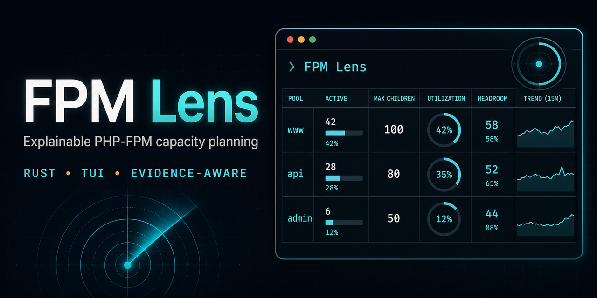
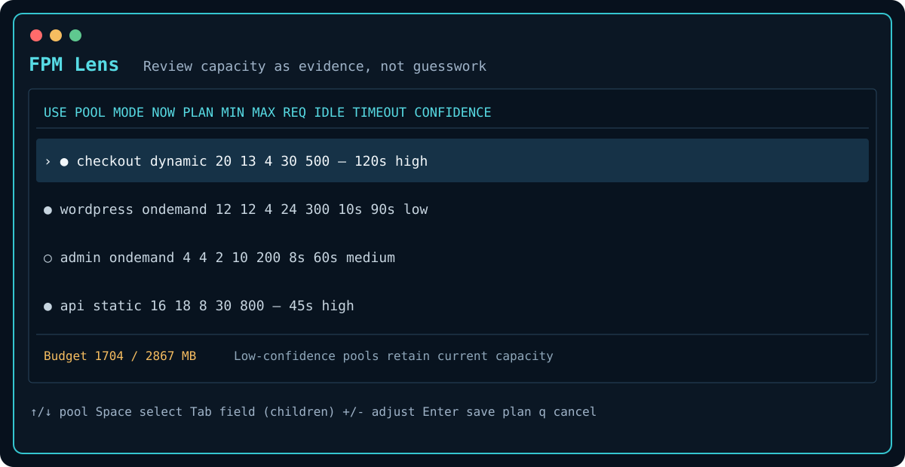

# FPM Lens

**Explainable PHP-FPM capacity planning, with a review-first terminal UI.**

[](https://github.com/itchyitchy123/php-fpm_auto-optimize/actions/workflows/test.yml)
[](LICENSE)



FPM Lens inventories PHP-FPM pools, collects workload evidence, and builds a
globally memory-bounded plan. It explains every decision and keeps configuration
generation separate from installation. Missing observations are treated as
uncertainty—not as proof that a pool is idle.

```text
FPM Lens plan — 1280 MB allocated / 2457 MB budget
POOL                   NOW    PLAN     MIN     MAX  EVIDENCE
checkout                 20       9       4      30  High
wordpress                12      12       4      24  Low
```

## Why it is different

- Per-pool memory costs: a 150 MB application and a 25 MB application are not
  modeled as interchangeable workers.
- Explicit uncertainty: low-confidence pools retain their current capacity.
- User constraints: each pool can have its own minimum, maximum, request cap,
  idle timeout, and request timeout.
- Global feasibility: the planner accounts for selected and unselected pools
  and refuses a plan whose minimums cannot fit.
- Reviewable artifacts: observations, policy, and plans are portable JSON/TOML;
  rendered PHP-FPM fragments are staged for inspection.
- Safe defaults: discovery and planning are read-only. `render` never edits
  `/etc` or reloads a service.

## Install

### Release binary

Release binaries are published for tagged releases. If the Releases page is
empty, use the source-build path below; the download commands intentionally do
not pretend that an unpublished asset exists.

Download a release binary—no Rust toolchain is needed:

```bash
arch=$(uname -m)
case "$arch" in
  x86_64) target=x86_64-unknown-linux-musl ;;
  aarch64|arm64) target=aarch64-unknown-linux-musl ;;
  *) echo "unsupported architecture: $arch" >&2; exit 1 ;;
esac
curl -fLO "https://github.com/itchyitchy123/php-fpm_auto-optimize/releases/latest/download/fpm-lens-$target"
curl -fLO "https://github.com/itchyitchy123/php-fpm_auto-optimize/releases/latest/download/fpm-lens-$target.sha256"
sha256sum -c "fpm-lens-$target.sha256"
```

Release binaries also carry signed GitHub/Sigstore build-provenance
attestations. With the GitHub CLI installed, verify one before installation:

```bash
gh attestation verify "fpm-lens-$target" --repo itchyitchy123/php-fpm_auto-optimize
```

Install the verified (or checksum-verified) binary:

```bash
sudo install -Dm0755 "fpm-lens-$target" /usr/local/bin/fpm-lens
```

Or build from source with Rust 1.85 or newer:

```bash
cargo build --release --locked
sudo install -Dm0755 target/release/fpm-lens /usr/local/bin/fpm-lens
```

Maintainers publish a release by pushing a matching `v<version>` tag. The
release workflow builds both Linux targets, emits SHA256 files, creates signed
GitHub build-provenance attestations, and smoke-tests the downloaded assets.
See [Contributing](CONTRIBUTING.md) for the release checklist. Until that
workflow has run for a tag, source builds are the supported installation path.

## Quick start

```bash
sudo fpm-lens inventory
sudo fpm-lens doktor
sudo fpm-lens observe --samples 12 --interval-seconds 5 \
  --status-url 'checkout=http://127.0.0.1/fpm-status?json'
sudo chown "$USER":"$(id -gn)" fpm-lens.evidence.json
fpm-lens --evidence fpm-lens.evidence.json review
fpm-lens render fpm-lens.plan.json --output-dir build/review
```

Pass `--pool-dir` repeatedly for fixtures or unusual layouts. Use
`--memory-mb` for a container or deliberate planning envelope.

## Terminal workflow



| Key | Action |
|---|---|
| `↑` / `↓` | Move between pools |
| `Space` | Include or exclude a pool from adjustment |
| `Tab` | Select children, min, max, requests, idle timeout, or request timeout |
| `+` / `-` | Adjust the selected value |
| `Enter` | Save reviewed policy and plan |
| `q` | Exit without saving |

For automation, skip the UI:

```bash
fpm-lens --policy production.toml --evidence evidence.json \
  plan --json --output production.plan.json
```

For a guided read-only run, combine collection and planning:

```bash
sudo fpm-lens --policy production.toml assess --samples 180 --interval-seconds 5 \
  --status-url 'checkout=http://127.0.0.1/fpm-status?json'
```

`doktor` checks discovery, procfs access, the detected memory envelope, and
available PHP-FPM validation binaries. Process-table sampling supplies PSS
(falling back to RSS) memory evidence. Active demand, listen queues, and
`max children reached` counters come only from explicitly configured local
PHP-FPM JSON status endpoints; existing idle workers are never counted as
active demand.

Plans can be reviewed on a different machine without PHP-FPM installed:

```bash
fpm-lens validate production.plan.json
fpm-lens diff production.plan.json
fpm-lens render production.plan.json --output-dir build/review
fpm-lens validate production.plan.json --php-fpm /usr/sbin/php-fpm8.3
```

The last command renders into a temporary workspace and runs the binary's `-tt`
check against each affected source configuration plus its staged override.
Evidence snapshots can be inspected with `report` or compared with
`compare older.json newer.json`. Pressing Ctrl-C during collection saves a
clearly marked partial observation instead of discarding it.

## Pool policy

Names apply across installations. Use `directory:name` when the same pool name
exists in multiple PHP versions.

```toml
[global]
reserve_memory_mb = 2048
memory_utilization_percent = 80
default_worker_memory_mb = 64
minimum_evidence_samples = 12
maximum_evidence_age_seconds = 86400
minimum_observation_seconds = 900
minimum_status_success_percent = 80
headroom_percent = 25
default_min_children = 2
default_max_children = 100

[pools.checkout]
selected = true
target_children = 18
min_children = 6
max_children = 40
max_requests = 500
process_idle_timeout_seconds = 15
request_terminate_timeout_seconds = 120
```

## Safety boundary

FPM Lens does not claim that an idle snapshot predicts peak production load.
Observe a representative traffic window, include memory used by the database,
web server, kernel, queues, and caches in the reserve, and load-test proposed
limits before deployment.

The initial Rust release deliberately stages output instead of installing it.
An operator or configuration-management system should validate generated files
with the matching `php-fpm -tt` and deploy them using the platform's supported
mechanism. This keeps the trust boundary visible and planning testable.

Rendered output includes `fpm-lens-render-manifest.json`, which maps
content-addressed staged paths back to their source pool directories. Reusing an
output directory removes only obsolete files recorded by that manifest. Plan
artifacts are checked for path safety, unique pools, arithmetic consistency,
dynamic-manager invariants, and memory-budget integrity before rendering.

## Automation contract

- Exit `0`: command completed successfully.
- Exit `1`: invalid input, discovery, observation, validation, or I/O failure.
- Exit `2`: a plan artifact was produced but is infeasible.

`plan --json` and `inventory` provide machine-readable stdout. Evidence and
plan output files use strict schemas; fatal diagnostics go to stderr.

## Project quality

Run `make check` for formatting, Clippy, tests, documentation, and a release
build.

| Platform | Inventory | Observe | Plan/render | CI |
|---|---:|---:|---:|---:|
| Debian / Ubuntu | ✓ | ✓ | ✓ | ✓ |
| RHEL / AlmaLinux / Rocky | ✓ | ✓ | ✓ | build-tested |
| Remi parallel PHP | ✓ | ✓ | ✓ | fixture-tested |
| cPanel EA-PHP | discovery only | limited | ✓ | fixture-tested |
| Other Linux layouts | `--pool-dir` | ✓ | ✓ | fixture-tested |

Documentation: [Architecture](docs/architecture.md),
[Algorithm](docs/algorithm.md), [Case study](docs/case-study.md),
[User guide](docs/user-guide.md),
[Artifact schemas](schemas/), [Security](SECURITY.md),
[Project history](docs/history.md), and [Contributing](CONTRIBUTING.md).

The Bash prototype is preserved in Git history and the
`bash-prototype-v0.5.0` tag. The default branch contains only the independently
designed Rust product; see [Project history](docs/history.md).
